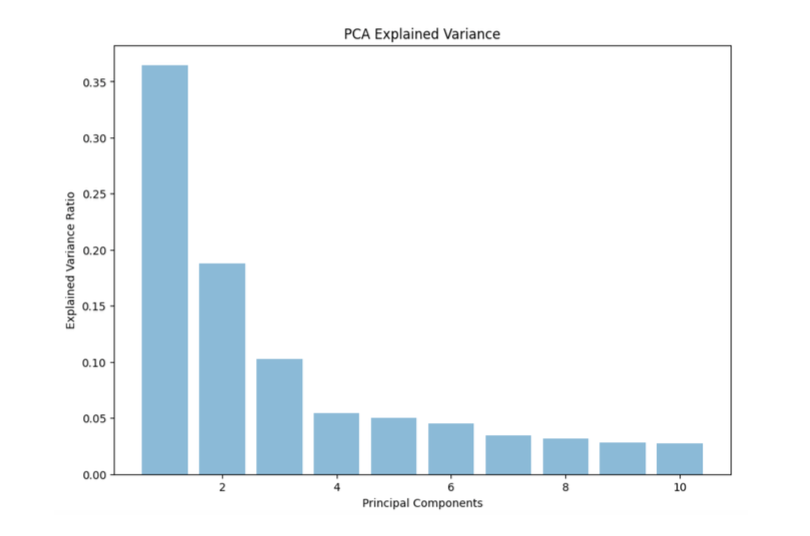
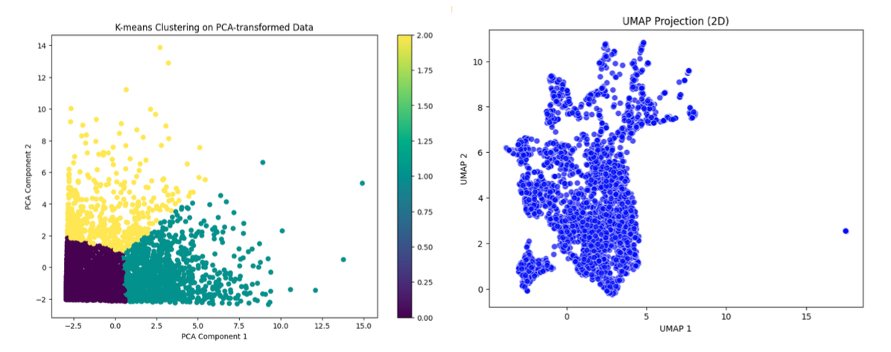
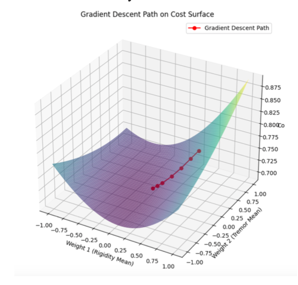
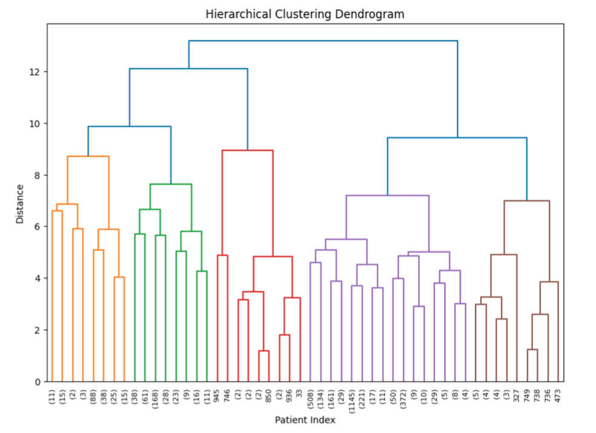
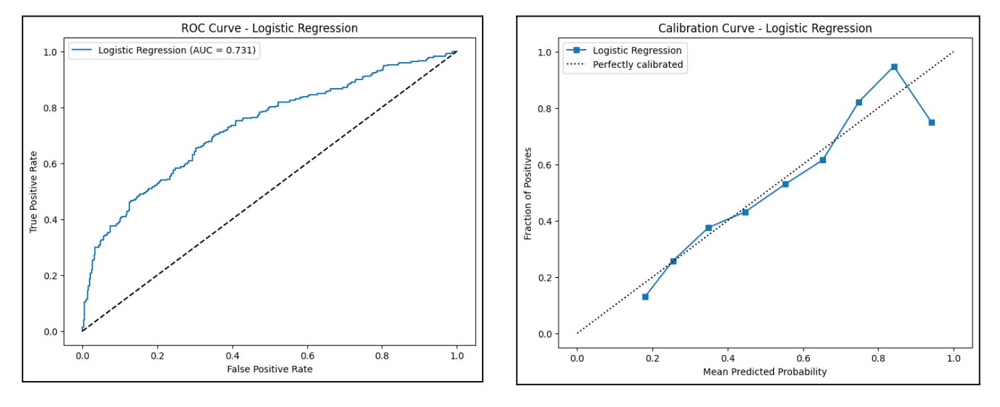
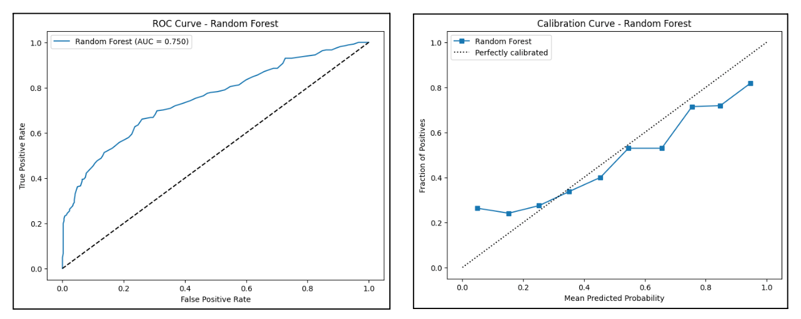
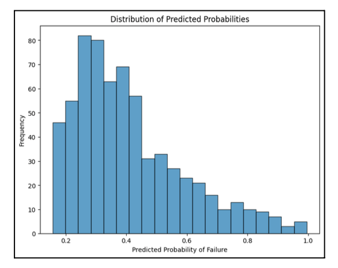
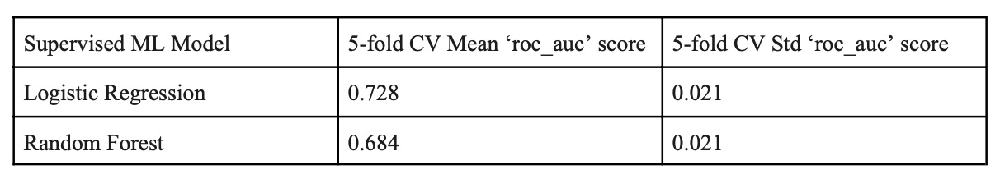
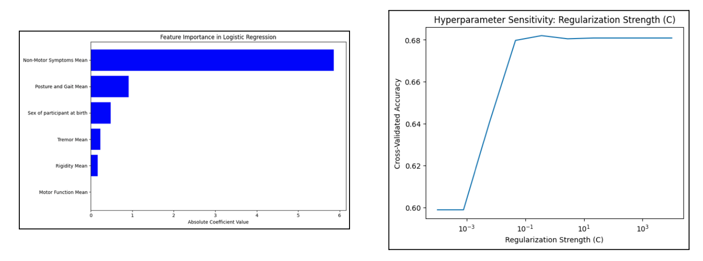

# Parkinson’s Disease Early Detection and Progression Analysis with Machine Learning

Our team utilized data from PPMI (Parkinson's Progression Markers Initiative) with machine learning to find ways to improve early detection of Parkinson's Disease. The goal is to determine the key features in Parkinson's Disease Development.

## Introduction
Parkinson's disease is estimated to affect over 14.2 million people by 2040 due to increasing longevity and declining birth rate. The disease progresses slowly, but early detection is critical in mitigatign its symptoms and improving the quality of life. 

## Data Source
We got our training data from [PPMI website](http://ppmi-info.org), which includes measurements from questionnaires. 

## Process
1. Data cleaning and transformation
2. Data exploration: PCA, K-Means Clustering
3. Feature Engineering: Importance Score
4. Unsupervised Learning: SGDC(Stochastic Gradient Descendent Classifier), Agglomerative Hierarchical Clustering
5. Supervised Learning: Logistic Regression, Random Forest, Neural Networks

## Unsupervised Learning Results
Our first attempt is dimensionality reduction with PCA. The bar plot below shows the variance changes iterate through each principal component. We selected the first 4 compoenent to pass through K-Means clustering model because they contain 95% of the variance in the data.
image: 

The plot below on the left shows the K-Mean Clustering result with 4 components and cluster size set to 3. Inner-cluster distances were small. No seperation between clusters were seen. The plot on the right is the UMAP result with 2 components. 
image: 

The next approach is SGDC (Stochastic Gradient Descendent Classifier) with learning rate set to “optimal” with log loss function, due to the high dimensionality of training data. Sigmoid function was added to the last layer due to the binary nature of the target values (Positive vs Negative for Parkinson's). A large amount of lower surface area on the lost/cost function curve. The path traced by the classifier converges to the local
  
minimum without any oscillation which means the learning rate is optimal in this case.
image: 

image: 

## Supervised Learning Results
image: 

image: 
image: 

## Evaluation
image: 
image: 

